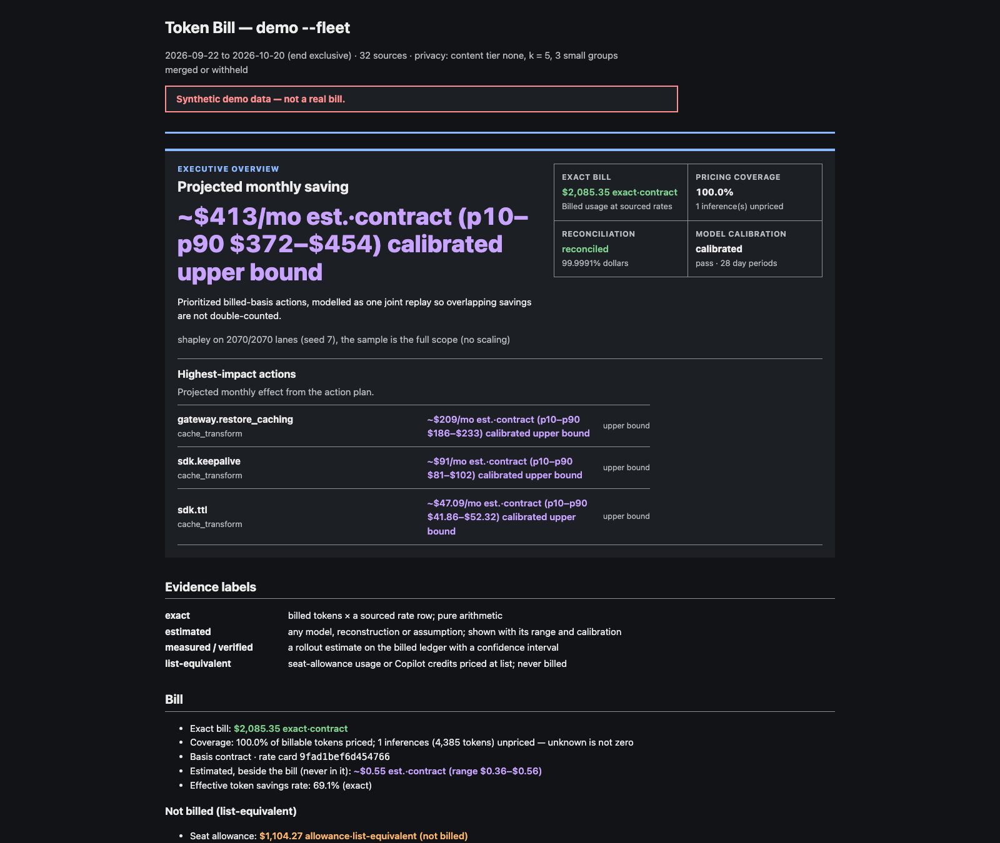

# Token Bill

> Local-first cost intelligence for LLM agents and coding assistants. Build a
> governed usage ledger from provider evidence, reconcile it with billing,
> isolate cost drivers, model defensible changes, and measure the result.

[](https://github.com/sedai77/tokenbill-llm-agent-cost-profiler/actions/workflows/ci.yml)
[](https://pypi.org/project/tokenbill/)
[](https://pypi.org/project/tokenbill/)
[](LICENSE)

> **Release status: v0.2.0 controlled enterprise pilot.** Token Bill is a
> local CLI, not a hosted analytics service or unattended enforcement system.
> It supports a governed ledger, content-free collection, provider and contract
> reconciliation, findings, policy artifacts, measurement, and exports. Every
> organization still needs to validate its provider contract, source coverage,
> quality metrics, and finance reconciliation before acting on a recommendation.

## What Token Bill Does Today

- Ingests content-free usage evidence, governed `trace@2` records, legacy
  `trace@1` files, OpenTelemetry GenAI data, and selected provider billing
  exports into a local SQLite ledger.
- Separates **billed/reconciled**, **rate-card or list-equivalent**, and
  **modeled/estimated** figures instead of rolling them into one misleading
  savings number.
- Reconciles Anthropic, OpenAI, AWS CUR, and GCP billing evidence by provider
  channel and time window; supports private rate and contract overlays.
- Finds cache, retry, failure-path, context, model, and workflow cost drivers;
  emits reviewable policy and measurement artifacts rather than changing a
  developer environment itself.
- Supports Claude Code evidence collection and file-based integrations for
  OpenAI, Azure-shaped records, Amazon Bedrock, generic OTLP, and GitHub
  Copilot evidence formats.

The default flow is offline after source exports are supplied. The only
built-in live provider pull in v0.2.0 is an optional Anthropic Admin API
reconciliation path. Its credential is read from an environment variable and
is never written to the ledger, reports, or logs.

## See The Fleet Report

The deterministic fleet demo exercises the current reporting path using a
keyless, networkless synthetic fleet: 61 developers, 28 days, reconciled
provider channels, and a calibrated action plan.

```bash
pip install tokenbill
tokenbill demo --fleet -o fleet-report.html
```

<p align="center">
  
  <br>
  <sub>Actual v0.2 output from <code>tokenbill demo --fleet</code>. The numbers are synthetic. The report labels reconciled, estimated, and list-equivalent figures separately.</sub>
</p>

The overview promotes only evidence-backed, Shapley-credited billed actions
into its headline. Trade-offs remain in the detailed findings with their
required evaluation evidence.

## How An Enterprise Runs It

Token Bill belongs inside the organization's existing data, security, FinOps,
and change-management boundaries:

```text
provider exports / application telemetry
        -> restricted collector or CI runner
        -> local Token Bill SQLite ledger
        -> provider and contract reconciliation
        -> findings, reviewable report, policy artifact, measurement receipt
        -> existing approval and rollout process
```

It is intentionally observation-first. It does not downgrade a model, rewrite
prompts, delete context, modify Copilot or IDE settings, or claim a subscription
allowance as cash savings.

Create a protected pilot workspace before ingesting employee or production
evidence. The central identity mode pseudonymizes identities in the controlled
workspace; use two-stage mode when the collector must transform identities
before data leaves its boundary.

```bash
PILOT=.tokenbill-pilot
CFG="$PILOT/config.json"
DB="$PILOT/store/tokenbill.db"

tokenbill init --dir "$PILOT" --identity-mode central --k 5
tokenbill --config "$CFG" ingest --db "$DB" --adapter otlp --content none exports/otel.json
tokenbill --config "$CFG" findings --db "$DB" --since 2026-09-01 --until 2026-10-01
tokenbill --config "$CFG" report --db "$DB" --since 2026-09-01 --until 2026-10-01 -o reports/fleet.html
```

For a scheduled job, pin an explicit adapter rather than relying on format
sniffing, retain the protected raw evidence needed to reproduce a result, and
enable `--strict-dq` only after the expected source coverage is understood.

Read the [enterprise pilot guide](docs/ENTERPRISE.md) for roles, rollout gates,
privacy controls, and measurement requirements. Read the
[integration guide](docs/INTEGRATIONS.md) for source-specific deployment
recipes and current feature boundaries.

## Integration Matrix

| Provider or source | Evidence Token Bill accepts | v0.2.0 status | Important boundary |
| --- | --- | --- | --- |
| Anthropic and Claude Code | `trace@1`, `trace@2`, local Claude Code evidence, Admin usage/cost pages, Enterprise Analytics | Supported pilot path | The legacy recorder captures prompt-bearing `trace@1`; treat it as sensitive. |
| OpenAI and Azure-shaped records | Responses/chat usage records, OpenAI usage and cost exports | Supported file-based path | Reconcile provider exports before presenting spend as billed. |
| Amazon Bedrock | Bedrock invocation logs or Converse response records, AWS CUR 2.0 CSV/CSV.gz | Supported file-based path | Token Bill does not need AWS credentials when a controlled export is supplied. |
| Generic OpenTelemetry | OTLP GenAI records and related traces | Supported file-based path | Preserve semantic-convention version and data-quality notes. |
| GitHub Copilot | AI usage CSV, metered usage CSV, recorded billing/config/metrics/seats/activity responses, local VS Code traces, OTEL, export bundles | Integration preview | Ingestion and detector components exist; the packaged end-to-end Copilot CLI and audited Copilot money-report path do not. See below. |

## Amazon Bedrock Setup

Use Bedrock in the same export-and-reconcile pattern as other cloud services.
Have the cloud platform team place either Bedrock invocation logs or
application-side Converse response records in a restricted export location, and
provide AWS CUR files for the same billing window. Keep account, region,
contract, and cost-allocation context in the protected source records.

```bash
PILOT=.tokenbill-pilot
CFG="$PILOT/config.json"
DB="$PILOT/store/tokenbill.db"

tokenbill --config "$CFG" ingest --db "$DB" \
  --adapter bedrock --content none exports/bedrock/

tokenbill --config "$CFG" reconcile --db "$DB" \
  --aws-cur exports/aws-cur/cur-2026-09.csv.gz \
  --since 2026-09-01 --until 2026-10-01 \
  --contract protected/bedrock-contract.json

tokenbill --config "$CFG" findings --db "$DB" \
  --since 2026-09-01 --until 2026-10-01 --min-usd 25
tokenbill --config "$CFG" report --db "$DB" \
  --since 2026-09-01 --until 2026-10-01 -o reports/bedrock-september.html
```

Use a contract overlay only for approved private rates or discount treatment;
keep it versioned and access-controlled. An invocation-derived rate-card total
is useful for diagnostics, but it becomes a finance claim only after the AWS
CUR reconciliation gate passes for that channel and window.

## GitHub Copilot: Current, Honest Status

The repository contains useful Copilot ingestion and analysis components. It
can import organization evidence through adapters such as
`github-ai-usage`, `github-metered-usage`, `github-billing-api`,
`github-copilot-config`, `github-copilot-metrics`, `github-copilot-seats`,
`github-copilot-activity-report`, `copilot-vscode-traces`, `copilot-otel`, and
`copilot-export`.

For a controlled evidence pilot, export the relevant organization reports using
the enterprise's normal GitHub administrator process, store them in a protected
location, and ingest them with an explicit adapter:

```bash
PILOT=.tokenbill-pilot
CFG="$PILOT/config.json"
DB="$PILOT/store/tokenbill.db"

tokenbill --config "$CFG" ingest --db "$DB" \
  --adapter github-ai-usage --content none exports/github/ai-usage.csv
tokenbill --config "$CFG" ingest --db "$DB" \
  --adapter github-metered-usage --content none exports/github/metered-usage.csv
tokenbill --config "$CFG" findings --db "$DB" \
  --since 2026-09-01 --until 2026-10-01
```

That is **not** yet a finished enterprise Copilot cost product in v0.2.0:

- There is no shipped `tokenbill copilot` command and no direct GitHub OAuth or
  live GitHub API pull in the public CLI.
- The generic `bill`, `report`, `showback`, and `policy` paths do not package
  Copilot pool, seat, allowance, and credit facts into a complete audited
  Copilot financial report. A generic bill can omit extension-owned Copilot
  facts rather than falsely converting them to cash.
- Do not use generic Token Bill output as a Copilot invoice, subscription
  showback, procurement decision, or automated Copilot policy. Treat the
  current path as evidence ingestion and detector evaluation only.

This distinction is deliberate documentation, not a licensing caveat. A
production Copilot workflow needs the missing public command and dedicated
summary/policy integration, plus fixture-backed tests against the GitHub plan
and billing model in use.

## Cost Labels Matter

| Label | Meaning | Can it be called realized savings? |
| --- | --- | --- |
| Billed or reconciled | Provider cost evidence and the ledger agree within the configured gate for a declared window. | Only after finance accepts the reconciliation. |
| Rate-card or list-equivalent | Usage or allowance priced from a rate card, entitlement, credit, or contract assumption. | No. It is a planning or diagnostic value. |
| Modeled or estimated | A counterfactual from a documented intervention and assumptions. | No. Measure quality and incremental spend after rollout. |
| Measured or verified | A registered rollout comparison with cost and quality evidence. | Potentially, subject to the enterprise's measurement and finance review. |

## Legacy Direct Anthropic Tracing

The original local recorder workflow remains supported for a single agent or
developer investigation. It records completed Anthropic SDK calls into a
prompt-bearing `trace@1` JSONL file, then analyzes cache economics.

```python
from pathlib import Path

from anthropic import Anthropic
from tokenbill.instrument import Recorder

client = Recorder(Path("trace.jsonl")).wrap(Anthropic())
```

```bash
tokenbill analyze trace.jsonl -o report.html
```

The recorder never imports the Anthropic SDK itself and keeps completed calls
when a run crashes, but the resulting file can contain prompts and source-code
context. Do not use it as the default enterprise collection route; start with
content-free `trace@2`, OTLP, or provider-export evidence instead. The exact
legacy trace contract is in [docs/SPEC.md](docs/SPEC.md), and the cache model
and attribution limits are in [DESIGN.md](DESIGN.md).

## Data And Change Controls

- Start with `--content none`; the fleet ingest path refuses full prompt
  collection. Use fingerprint evidence only for a defined question and an
  approved retention plan.
- Keep generated keys, the SQLite ledger, raw exports, contract overlays, and
  reports outside source control and under the enterprise's normal access and
  retention controls.
- Keep provider, region, billing period, currency, allowance, discount, and
  contract facts separate. Never turn a seat allowance or AI credit into an
  invoice total by arithmetic alone.
- Treat generated policy as a review artifact. Use the existing approval,
  rollout, rollback, exception, and quality-evaluation process to apply it.
- Run data-quality and reconciliation gates before publishing an executive
  number. A lower model bill that increases rework is not a savings result.

## Start Locally

```bash
pip install tokenbill
tokenbill demo
tokenbill demo --fleet -o fleet-report.html
```

The bundled demos are deterministic, synthetic, keyless, and networkless. They
certify the instrument path, not an enterprise's provider configuration or
financial results.

## Contributing And Verification

See [CONTRIBUTING.md](CONTRIBUTING.md) for the development environment,
[docs/SPEC.md](docs/SPEC.md) for the core contracts,
[SECURITY.md](SECURITY.md) for security reporting,
[docs/SUPPLY-CHAIN.md](docs/SUPPLY-CHAIN.md) for release verification, and
[CHANGELOG.md](CHANGELOG.md) for release history.

MIT Copyright 2026 Token Bill contributors. See [LICENSE](LICENSE).
